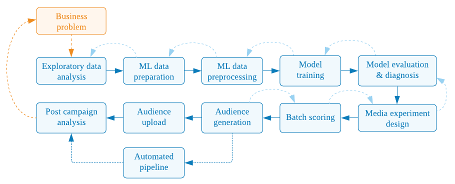

# Propensity Modeling and Media Activation Notebooks

**This is not an official Google product.**

This repository contains multiple notebook packages (Propensity, Customer
Lifetime Value (LTV), Forecasting etc.) for Marketing Data Scientists to
optimize data science project workflow (ETL, feature engineering, modeling
notebooks, automation scripts etc).

Contributions are encouraged - see [CONTRIBUTING.md](../../CONTRIBUTING.md).

## Overview

This folder contains Python Notebook Templates for building an end-to-end
Propensity Modeling solution using datasets like GA360, Firebase or CRM and
use the propensity predictions to design, activate and measure the impact of a
Google media campaigns. These Notebook Templates rely on the Python modules
open sourced in [gps_building_blocks](https://github.com/google/gps_building_blocks).

## What is a Propensity Model?
A Propensity Model helps to estimate the propensity (probability) of and event
(for example, conversion, churn, purchase etc.) happening during a well-defined
time period into the future (called *prediction window*) based on historical
data captured during a well-defined time window in the past (called
*lookback window*).

* In business context, the *future events* can be a customer performing
  some action such as a purchase, subscription, churn etc.
* The estimated propensity scores can be used to make data-driven decisions,
  such as improving remarketing or acquisition campaigns, in order to optimize key
  business objectives, such as increasing conversions or reducing churn.
* The insights extracted from a propensity model is helpful to understand
  key ‘drivers’ that are highly correlated with (or caused on) the
  target event of interest, some of which would lead the business to take useful
  actions (called *actionable insights*).

### Requirements

#### Dataset

In order to build a Propensity Model, one needs to prepare a dataset (CRM, GA360
or Firebase) containing customers’ past behavioral data such as demographics,
transactional or browsing behaviour over time. This data should include a
sufficient number of examples of the *action* to be predicted and the fields
that capture user behaviour or characteristics prior to that action. This
action event is called the `target`, `label` or `response`.  It is recommended
to use at least one year of data (ideally 2 years) to capture seasonal
patterns of the user behaviour.

**Example:**

GA360 dataset exported to BigQuery that captures customers’ online behaviour on
designated website can be used for Propensity Modeling. The dataset format and
BigQuery export instructions are described [here](https://support.google.com/analytics/answer/3437618?hl=en&ref_topic=3416089).
In GA360 dataset, an example of a `target` definition
could be `hits.eCommerceAction.action_type = '6'`, which reflects a transaction.
The user behaviour could be indicated by fields such as `totals.hits`,
`totals.timeOnSite`, `trafficSource.source` and `device.deviceCategory` etc.

#### Google Cloud Platform (GCP) permissions

In order to run notebooks, user needs to have following permissions on GCP:

- BigQuery User
- Notebooks Legacy Admin
- AutoML Editor
- Service Usage Admin
- Service Account User

For more details refer to https://cloud.google.com/iam/docs/understanding-roles.

## How a propensity modeling problem can be translated into a Machine Learning (ML) problem?

The Propensity Modeling is generally formulated as a classification ML problem.
Typically, binary classification is used to model the propensity of a binary
event such as purchase vs non-purchase, and multi-class classification to model
the propensity of a multinomial event. In the case of a binary event, for each
`user id` a corresponding `propensity score` is generated which can be used to
rank or segment the customers for more personalized marketing as explained
towards the end of this document.

## Steps of building a Propensity Model

Assuming the data (CRM, Firebase or GA360) is already available as a BigQuery
table, the following steps are involved in building and activating an
end-to-end Propensity Modeling solution to drive a Google Marketing use case.

1. Data audit and exploratory data analysis - [01.eda.ipynb](01.eda.ipynb).
2. ML data preparation - [02.ml_data_preparation.ipynb](02.ml_data_preparation.ipynb).
3. ML data preprocessing - [03.ml_data_preprocessing.ipynb](03.ml_data_preprocessing.ipynb).
4. ML model training - [04.model_training.ipynb](04.model_training.ipynb).
5. ML model evaluation and diagnostics - [05.model_evaluation_and_diagnostics.ipynb](05.model_evaluation_and_diagnostics.ipynb).
6. Media experiment design - [06.media_experiment_design.ipynb](06.media_experiment_design.ipynb).
7. Batch scoring - [07.batch_scoring.ipynb](07.batch_scoring.ipynb).
8. Audience generation - [08.audience_generation.ipynb](08.audience_generation.ipynb).
9. Audience upload - [09.audience_generation.ipynb](09.audience_generation.ipynb).
10. Post-campaign Analysis - [10.post_campaign_analysis.ipynb](10.post_campaign_analysis.ipynb).
11. Automated scoring and media activation - [Notebook - WIP].
12. Cleanup BigQuery artifacts - [12.cleanup.ipynb](12.cleanup.ipynb).

The following sections provide details of each step.

### 1. Data audit and exploratory data analysis

Notebook - [01.eda.ipynb](01.eda.ipynb).

This step analyses the original input data at a high level to make sure
that the variables and values available for the required time period to
create an ML model to solve the business problem at hand.

This involves the following steps:
* Extraction of the dataset schema and field descriptions
* Explore data size and duration of the GA data tables

### 2. ML data preparation

Notebook: [02.ml_data_preparation.ipynb](02.ml_data_preparation.ipynb).

Creation of an ML dataset from customer behaviour data such as GA360,
Firebase or CRM involves:

* First creating a single data snapshot of users with respect to a given
  calendar date *d*. This snapshot consists of:
    * Instances: for example, all the users who have done some action in a
      website up until the date *d*.
    * Features: for each selected instance, aggregated behavior in a well-defined
      time period in the past from day *d* called *lookback window*.
    * Labels: for each selected instance, the value we would like to predict
      (e.g. purchased or not purchased) in a well-defined time period into the
      future from the day *d* called *prediction window*.
* Second, generating a series of such snapshots over time to capture recency,
  frequency and changing behaviour of users, seasonality and other trends/events
  over time. This is vital in a period like Covid-19 to capture changing user
  behaviour which is also known as the Concept Drift. Also, with multiple
  snapshots, we would be able to generate more data for our ML model with limited
  original data.

The quality of an ML model greatly depends on the quality of the input data.
Since different datasets contain different data issues such as missing,
incorrect and inconsistent data, it is vital to do a deep data exploration and
select the most consistent and meaningful variables/row data to create an ML
dataset.

[ML Windowing Pipeline (MLWP)](https://github.com/google/gps_building_blocks/tree/master/py/gps_building_blocks/ml/data_prep/ml_windowing_pipeline) and
[ML Data Visualizer](https://github.com/google/gps_building_blocks/tree/master/py/gps_building_blocks/ml/data_prep/data_visualizer)
modules can be used in order to create an accurate and rich ML dataset efficiently.

#### MLWP + ML Data Visualizer

Creation of an ML datasets with multiple snapshots usually takes about 80% of
the project time (the major bottleneck of the ML model building process). Use of
MLWP together with ML Data Visualizer module can help to reduce this time from
2-3 weeks to 1-2 days.

MLWP creates an ML dataset by taking multiple data snapshots over time in a
very fast way. It has been built to run on BigQuery and the input data is
expected to be available as a BigQuery table. The developer can simply specify
the time-related inputs (e.g. starting and ending dates of the snapshots
and sizes of the *lookback*, *prediction* and *sliding windows*), variable names
and aggregate functions to generate features and labels.

Data Visualizer module automatically generates plots visualizing the quality and
consistency of raw input data to help selecting right variables to generate the
ML dataset and also visualize the generated ML data to further identify issues
such as label leakage.

This step consists of running the following sub steps as implemented in the
[02.ml_data_preparation.ipynb](02.ml_data_preparation.ipynb):

* 2.1. MLWP Data Extraction pipeline: extracts and formats the original data from
  the BigQuery table into several temporary tables for further processing.
* 2.2: MLWP Exploration Pipeline: outputs facts (original variables converted into
  *user_id*, *time_stamp*, *variable* and *value* format, called *facts*) and ML
  instances into BigQuery tables for data exploration and analysis.
* 2.3.1: Data Viz Visualize Instances: generates the following plots on ML
  instances:
    * plots with the number of total instances, number of positive instances and
    proportion of positive instances for each snapshot. These plots are helpful to
    understand how the label is distributed over time, any seasonality and trends,
    and whether there are any inconsistencies. Based on this we can drop specific
    periods of snapshots having any data issues and consider what additional
    features to add to capture the seasonality or any trends of the label over
    time.
    * class specific distribution plots for the *days_since_first_activity*
    (corresponds to tenure) and *days_since_latest_activity* (corresponds to
    recency) features in the Instance table. From these plots, we can determine a
    reasonable *lookback window* period and to reason whether it’s worth only
    using customers having a particular history and recency for modeling.
* 2.3.2. Data Viz Visualize Facts: generates plots of numerical and categorical
  *fact variables*, which can be used to explore their validity and distribution
  over time. Based on that we can make decisions such as which *facts variables*
  (and which levels in categorical *fact variables*) to use to generate features
  in the remaining steps.
* 2.4: MLWP Data Windowing Pipeline: segments the user data into multiple,
potentially overlapping time windows, with each window containing a
*lookback window* and a *prediction window*.
* 2.5: Run Feature Generation Pipeline: generates features from the windows of
data computed in the previous step and outputs to a table in BigQuery.
* 2.6: Data Viz Visualize Features: visualizes the statistics calculated from the
Features table in BigQuery. The plots include class-specific distribution plots
of numerical and categorical features, which can be used to explore the validity
of the features and potentially identify issues such as label leakage, and the
distribution of the features over time helping to understand the consistency.
Based on these insights the developer can select only the valid features for
training the model.

### 3. ML data preprocessing

Notebook: [03.ml_data_preprocessing.ipynb](03.ml_data_preprocessing.ipynb).

This notebook demonstrates the preparation of an already created ML dataset for model development. It is vital to split machine learning datasets in such a way that the model performance can be tuned and fairly assessed. This notebook shows an example of dividing a dataset into out-of-time TEST dataset (including selected full snapshot/s) and DEVELOPMENT dataset (randomly splitting the rest of the snapshots into TRAIN,VALIDATION and TEST). Those names are designed to be directly used in the AUTOML [DATA_SPLIT_COL](https://cloud.google.com/bigquery-ml/docs/reference/standard-sql/bigqueryml-syntax-create#split-inputs).
This step involves the following tasks:

#### 3.1. Data splitting
Once we are happy with the extracted ML-ready dataset, it can be separated into
Training, Validation and Testing datasets as shown in the following diagram:

The ML examples extracted from the *model development period* are divided into
*Training* (e.g. 80% of instances), *Validation* (e.g 10% of instances) and
*Testing* (in-time) (e.g. 10% instances) partitions, such that each of these
data partition contain a mutually exclusive random subset of instances. We
called this dataset as *Model Development* dataset. In addition to the in-time
Testing dataset, an out-of-time Testing dataset is also created to specially
test the model performance in recent times.

#### 3.2. Data balancing

If the percentage of positive examples in the dataset is < 1% and the number of
positive examples are limited compared to the negative examples, it can be
beneficial to balance training datasets to have ~1% of positive examples by
randomly dropping the negative instances. While doing this we make sure to only
balance the training dataset partition and keep the both validation and testing
partitions in their original imbalance form.

### 4. ML model training

Notebook: [04.model_training.ipynb](04.model_training.ipynb).

Creating an ML model generally can be a complicated, iterative and long process
due to the algorithm selection and hyper-parameter tuning steps.
However, in this solution, we use [GCP BQML tool with the AutoML models](https://cloud.google.com/bigquery-ml/docs/reference/standard-sql/bigqueryml-syntax-create-automl)
option (by default), which uses GCP AutoML to automatically handles feature
preprocessing and hyper-parameter tuning for multiple algorithms in parallel to
train the best model with respect to a given performance metric such as AUC ROC.

We use *Model Development* dataset to crested in the previous step to develop the
model with the *Training*, *Validation* and *Testing* partitions. AutoML uses
the *Training* and *Validation* partitions for hyper-parameter tuning and
algorithm selection, and reports the final results on the *Testing* partition
with the final model trained on the whole *Model development* dataset.

### 5. Model evaluation and diagnostics.

Notebook: [05.model_evaluation_and_diagnostics.ipynb](05.model_evaluation_and_diagnostics.ipynb).

It is important to diagnose a model thoroughly to make sure it’s reasonable (a
single performance metric such as overall accuracy or AUC doesn’t give the full
picture of the model) and to generate new business insights for the client. This
step uses the [Binary Classification Diagnostics](https://github.com/google/gps_building_blocks/tree/master/py/gps_building_blocks/ml/diagnostics)
module to generate a variety of stats and plots helping to understand the
performance for different propensity segments, diagnose the model for issues
such as label leakages and generate business insights that can be shared with
the clients directly.

The main diagnostics generated by this step as follows:

* Model performance with respect to a variety of metrics such as:
  * Area under curve ROC
  * Area under curve Precision-Recall
  * Overall Accuracy
  * True positive rate (Recall, Sensitivity)
  * True_negative_rate (Specificity)
  * Precision
  * F1_score
* Precision vs Recall curve
* Precision vs (1-Specificity) curve
* Predicted probability distributions for both classes
* Precision and Recall plots for different predicted probability bins
* Precision and Recall plots for different cumulative predicted probability bins
* Plots showing the relationship between each feature and the predicted
probability (helpful to extract new business insights and identify issued such
as label leakages)

TODO(): add a diagram of the above plots combined.

### [6. Media experiment design](#media-experiment-design)

Notebook: [06.media_experiment_design.ipynb](06.media_experiment_design.ipynb).

This step helps to design a statistically sound media experiment to activate the
developed propensity model in order to optimize a Google media campaign.

#### Experiment design I: Different propensity groups

One way to use the output from a propensity model to optimize marketing is to
first define different audience groups based on the predicted probabilities
(such as High, Medium and Low propensity groups) and then test the same or
different marketing strategies with those. This strategy is more useful to
understand how different propensity groups respond to remarketing campaigns.

Here we estimate the statistical sample sizes required for different groups
(bins) of the predicted probabilities based on different combinations of the
expected minimum uplift/effect size, statistical power and statistical
confidence levels specified as input parameters. Based on the estimated sample
sizes and the available sizes one can decide what setting (expected minimum
uplift/effect size at a given statistical power and a confidence level) to be
selected for the experiment. Then the selected sample sizes could be used to set
Test and Control cohorts from each propensity group to implement the media
experiment.

#### Experiment design II: Top propensity group

Another way to use the output from a propensity model to optimize marketing is
to target the top *X%* of users having the highest predicted probability in a
remarketing campaign or an acquisition campaigns with the similar audience
strategy.

Here we estimates the statistical sample sizes required for different cumulative
groups (bins) of the predicted probabilities (top *X%*, top *2X%* and so on)
based on different combinations of the expected minimum uplift/effect size,
statistical power and statistical confidence levels specified as input
parameters. Based on the estimated sample sizes and the available sizes one can
decide what setting (what top *X%* of users with the expected minimum
uplift/effect size at a given statistical power and a confidence level) to be
selected for the experiment. Then the selected sample size could be used to set
Test and Control cohorts from the top *X%* to implement the media experiment.

### 7. Batch scoring

Notebook: [07.batch_scoring.ipynb](07.batch_scoring.ipynb).

In this step we used the developed propensity model to score new ML instances to
predict their propensities. This step consists of the following sub steps:

* Create the ML instances and features for scoring using the MLWP
* Score the created instances using the developed model and uploaded the
  predictions into a table in GCP BigQuery

### 8. Audience generation

Notebook: [08.audience_generation.ipynb](08.audience_generation.ipynb).

This step generates a propensity audience for a remarketing use case. It uses
the propensity scores generated from the previous step to generate Test and
Control audience groups for a remarketing campaign according to the sample sizes
estimated in the step [*6.Media experiment design*](#media-experiment-design). The output of this steps is
written to a new BigQuery table.

### 9. Audience upload

Notebook: [09.audience_upload.ipynb](09.audience_upload.ipynb).

This step uses [GMP and Google Ads Connector](https://github.com/GoogleCloudPlatform/cloud-for-marketing/tree/main/marketing-analytics/activation/gmp-googleads-connector#gmp-and-google-ads-connector) to upload the created propensity audience into Google
Marketing Platform.

The uploaded audiences could be activated as acquisition or remarketing (in this
case) campaigns in the selected Google Ad product (Search, Display and YT). The
control groups generated and saved in BigQuery to be used at the analysis stage.

### 10. Post campaign analysis

Notebook: [10.post_campaign_analysis.ipynb](10.post_campaign_analysis.ipynb).

This step analyses the results of a media campaign executed by using propensity
audiences, that is, the comparison of conversion rates between Test and Control
audience groups by using the appropriate statistical significance tests.

### 11. Automated scoring and media activation

TODO(): Add content when the Notebook is submitted.

### 12. Cleanup BigQuery artifacts

This step helps to clean up interim tables generated while executing notebooks
from 01 to 09.
